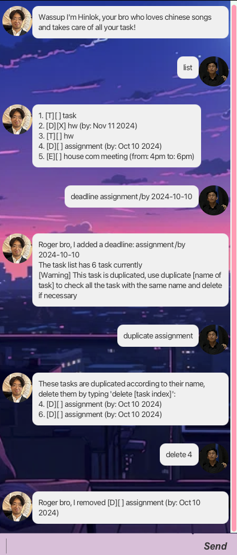

# Hinlok User Guide - a bro that manages tasks



---
## Introduction

**Hinlok** is a handsome chatbot built to help you keep track of your tasks!💛

---

## Add Commands

> 👨🏻‍💻Hinlok offers the following add commands:

### **todo**: Add to-do task into task list. 

Simply key in `todo [task description]` to add todo

Example: 

    todo homework

### **deadline**: Add deadline task into task list.
   
Simply key in `deadline [task description] /by yyyy-mm-dd` to add deadline
    
Example: 

    deadline homework /by 2024-10-10

### **event**: Add event task into task list. 
    
Simply key in `event [task description] /from [time] /to [time]` to add event

Example: 

    event homework /from 4pm /to 6pm

---
## Other features

### List command

Simply key in list to see all you current task in your task list

Example: `list`
```
1. [E][ ] homework (from: 5pm to: 6pm)
2. [T][ ] buy grocery
```

### Delete command

Simply key in delete [index of task] to delete task in your task list

Example: `delete 1`
```
Roger bro, I removed [T][ ] task
```


### Find command

Simply key in find [task description] to find task in your task list

Example: `find homework`
```
Got it bro, here are the matching tasks in your list:
[T][ ] homework
```

### Mark command

Simply key in `unmark [index of task]` to mark a task as done

Example: `mark 1   `
```
Roger bro, I marked this task as done:
homework
```

### Unmark command

Simply key in `mark [index of task]` to mark a task as undone

Example: `umark 1`
```
Roger bro, I marked this task as undone:
homework
```

### Duplicate command
Simply key in  'duplicate [task description]' to check if the task is duplicated 
and see the index of duplicated task

Example: `duplicate homework`
```
These tasks are duplicated according to their name, delete them by typing 'delete [task index]':
2. [T][ ] homework
3. [T][ ] homework
```

## Exit
Simply key in `bye` to exit!